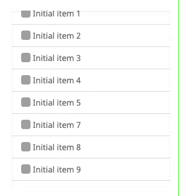

# 📜 bx-stable-infinite-scroll

[Demo](https://cathykc.github.io/bx-stable-infinite-scroll/)

Stable bi-directional infinite scroll React component. Load additional data from both ends of a container while maintaining current view. Used for chat, timeline, feed views.

## Documentation

### Installation

```
npm install --save bx-stable-infinite-scroll

# or

yarn add bx-stable-infinite-scroll
```

### Usage

| Prop               | Type         | Description                                                                                                             |
| ------------------ | ------------ | ----------------------------------------------------------------------------------------------------------------------- |
| `loadingComponent` | `ReactNode`  | What to display when fetching more data (e.g. `<div>Loading...</div>`).                                                 |
| `nextDataFn`       | `() => void` | Function to fetch next rows.                                                                                            |
| `nextEnd`          | `boolean`    | No more next rows to fetch.                                                                                             |
| `nextLoading`      | `boolean`    | Fetching next rows.                                                                                                     |
| `previousDataFn`   | `() => void` | Function to fetch previous rows.                                                                                        |
| `previousEnd`      | `boolean`    | No more previous rows to fetch.                                                                                         |
| `previousLoading`  | `boolean`    | Fetching previous rows.                                                                                                 |
| `initialReverse`   | `?boolean`   | Indicate whether data will initially be loaded from top or bottom of container. Default `true` (loading data from top). |
| `children`         | `ReactNode`  | Rows to render                                                                                                          |


See [demo code](https://github.com/cathykc/bx-stable-infinite-scroll/blob/master/examples/src/App.tsx) for detailed usage example.


**🚨 Use unique keys for children**

Make sure the elements you're passing into `<BxInfiniteScroll>` have unique and consistent keys.

```
<BxInfiniteScroll {...props}>
  {map(rows, (row) => {
    return <div key={row.id}>{row.content}</div>
  })}
</BxInfiniteScroll>
```


